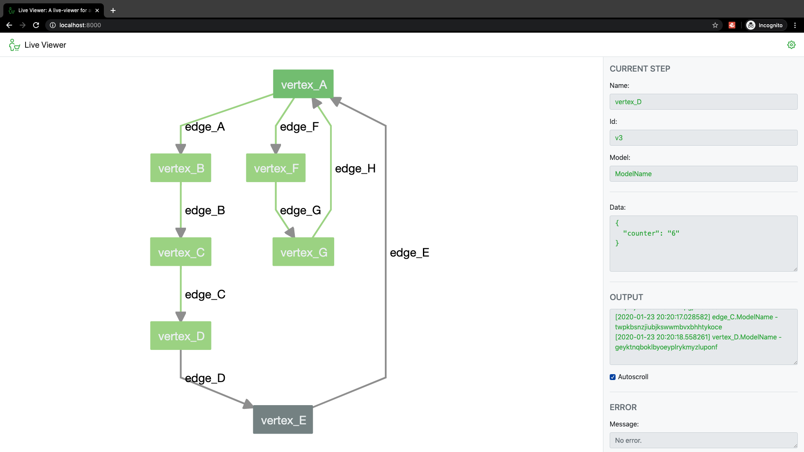

# LiveViewer

A live viewer for an AltWalker test run.



## Setup

> Note: You need to have AltWalker installed to use the LiveViewer.
> You can read the installig documentation [here](https://altom.gitlab.io/altwalker/altwalker/).

Clone the repo:

```bash
$ git clone git@gitlab.com:altom/altwalker/live-viewer.git
$ cd live-viewer
```

Install the command line tool:

```bash
$ pip install --editable .
```

Now if the cli was installed correctly you can type:

```bash
$ live-viewer --version
```

And you should see:

```
LiveViewer, version 0.1
```

## Running

Prerequisites:

* model(s)
* tesc code for the model(s)

> Note:
> If you can run your tests using `altwalker online` you have everything you need for the LiveViewer.

The `live-viewer server` command shares the arguments and options with `altwalker online`, with the exception that `-p` will set the websocket port and `--graphwalker-port` will set the port for the GraphWalker service.

To start the websocket server:

```bash
$ live-viewer server path/to/tests/ -m path/to/model.json "generator(stop_condition)" -x [python|dotnet]
```

Example:

```bash
$ live-viewer server tests -m models/default.json "random(never)"
```

After you start the webscoket server you need to start a webserver.

```bash
$ live-viewer open
```

Now visit: http://localhost:8000/.

Or open the file from `live-viewer/ui/index.html`.

## Troubleshooting

If you have troubles runnig the LiveViewer make sure that your models and code are valid.

Use:

* `altwalker check` - for the model(s).
* `altwalker verify` - for code.

## Documentation

### Getting help on commands and option names

* `-h`, `--help`: Show a help message and exit.

```bash
$ live-viewer --help
```

```bash
$ live-viewer server --help
```

```bash
$ live-viewer open --help
```

### Websocket

### Develop
