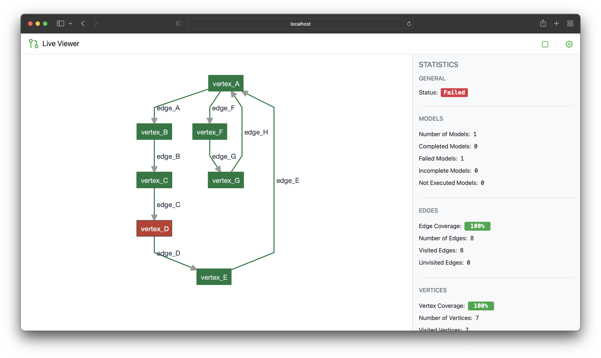

# AltWalker's LiveViewer

A web application for visualizing the progress of an AltWalker test run.

AltWalker's LiveViewer is a powerful tool designed to enhance your experience with AltWalker. This application provides real-time visualization and monitoring capabilities for your AltWalker test runs, allowing you to gain deeper insights into test execution, track progress, and identify potential issues with ease. With AltWalker's LiveViewer, you can effortlessly keep an eye on the execution of your test models and ensure the success of your testing endeavors.



## Setup

> **Note**: You need to have AltWalker installed to use the LiveViewer.
> You can read the installing documentation [here](https://altwalker.github.io/altwalker/).

Install the command-line tool:

```bash
pip install altwalker-live-viewer
```

Now if the CLI was installed correctly you can type:

```bash
altwalker-viewer --version
```

And you should see:

```
altwalker-viewer, version 0.4s.0
```

## Running

Prerequisites:

* model(s)
* test code for the model(s)

> **Note**:
> If you can run your tests using `altwalker online` you have everything you need for the LiveViewer.

The `altwalker-viewer online` command shares the arguments and options with `altwalker online`, with the exception that `-p` will set the websocket.

To start the websocket server:

```bash
altwalker-viewer online path/to/tests/ -m path/to/model.json "generator(stop_condition)" -x [python|dotnet]
```

Example:

```bash
altwalker-viewer online tests -m models/default.json "random(never)"
```

After you start the websocket server you need to start a WebServer (the WebServer will serve the LiveViewer frontend).

```bash
altwalker-viewer open
```

Now visit: <http://localhost:8000/>.

## Troubleshooting

1. If you have troubles running the LiveViewer make sure that your models and code are valid. Ues:

    * `altwalker check` - for the model(s).
    * `altwalker verify` - for code.

2. If you have trouble running the `live-viewer online` command make sure there are no GraphWalker processes running.

## Documentation

### Getting help on commands and option names

* `-h`, `--help`: Show a help message and exit.

```bash
altwalker-viewer --help
```

```bash
altwalker-viewer online --help
```

```bash
altwalker-viewer open --help
```

## Development Setup

* python3
* node
* NPM

### Install NPM dependencies

```bash
npm install
```

### Install PyPi dependencies

```bash
pip install -r requirements
```

### Build the frontend

```bash
npm run build
```

```bash
npm run start
```

### Install the CLI

```bash
pip install -e .
```

## License

This project is licensed under the [GNU General Public License v3.0](https://github.com/altwalker/live-viewer/blob/main/LICENSE).
